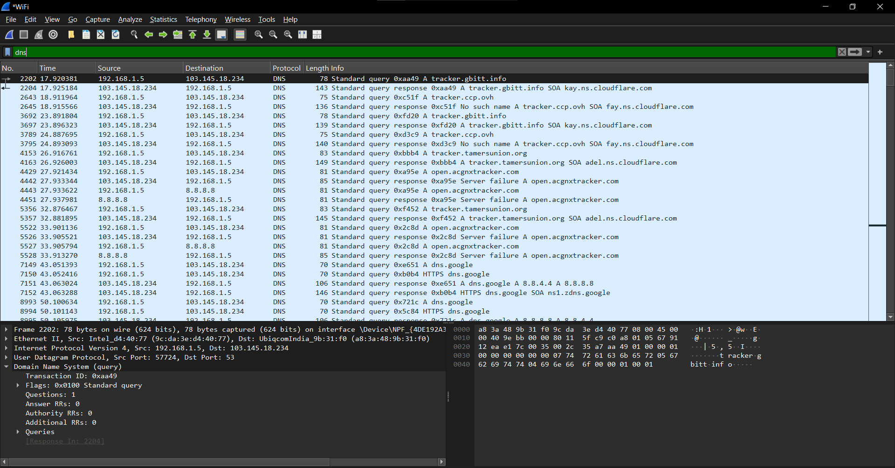
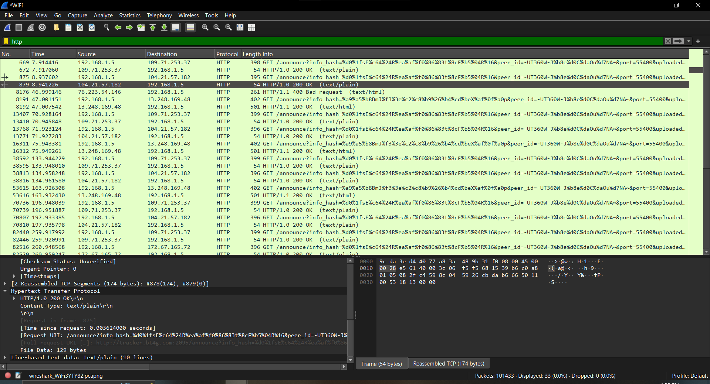
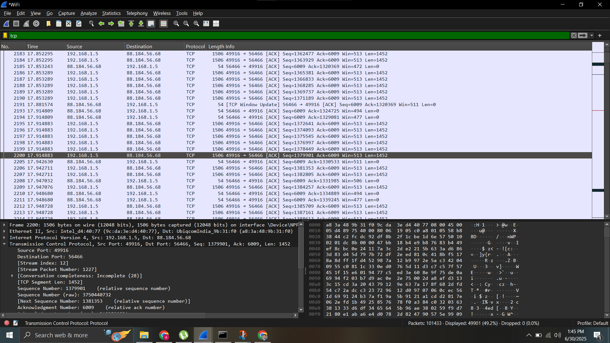

# Network Capture Task 5

This repository contains the results and analysis of various types of network traffic captured using Wireshark. It includes inspection of DNS responses, HTTP traffic, TCP handshakes, ICMP unreachable messages, and more.

## 📁 Folder Structure
.
├── screenshots/
│ ├── dns-traffic.png
│ ├── http-request.png
│ ├── icmp-time-exceeded-frame-2320.png
│ ├── tcp-data-transfer.png
├── README.md

## 📄 Download the PCAP File

Due to GitHub's file size restrictions, the `.pcap` file is hosted externally:

👉 [Download network-capture-task5.pcap](https://drive.google.com/file/d/15SoFo0HRvkobZ09XLvoUC8DYyPnIlyct/view?usp=drive_link)

## 🔍 Captured Network Events

### 1. DNS Traffic

- **Frame:** 7152  
- **Protocol:** DNS over UDP  
- **Source IP:** `103.145.18.234`  
- **Destination IP:** `192.168.1.5`  
- **Details:**  
  A standard DNS response with no answers, but one authoritative nameserver.

**Screenshot:**  

---

### 2. HTTP Request and Response

- **Frame:** 8192  
- **Protocol:** HTTP over TCP  
- **Source IP:** `13.248.169.48`  
- **Destination IP:** `192.168.1.5`  
- **HTTP Code:** `200 OK`  
- **Content-Type:** `text/html`  
- **Content-Length:** `326 bytes`  
- **URI:** `/announce?...event=started...`  
- **Request in:** Frame 8191

**Screenshot:**  

---

### 3. tcp-data-transfer

- **Frame:** 8196  
- **Protocol:** TCP  
- **Source Port:** `80`  
- **Destination Port:** `50379`  
- **Flags:** `RST`  
- **Sequence Number:** 449  
- **Acknowledgment Number:** 0

**Screenshot:**  

---

### 4. ICMP Destination Unreachable

- **Frame:** 12688  
- **Protocol:** ICMP  
- **Source IP:** `197.231.179.181`  
- **Destination IP:** `192.168.1.5`  
- **ICMP Type:** 3 (Destination Unreachable)  
- **Code:** 3 (Port Unreachable)  
- **Captured Length:** 177 bytes

**Screenshot:**  
[icmp-time-exceeded-frame-2320](./screenshots/icmp-time-exceeded-frame-2320.png)

---

## Capture File

- **Filename:** `network-capture-task5.pcap`  
- **Details:** Full Wireshark capture file containing all analyzed frames and sessions.
- Useful for reproducing the analysis, filtering by protocol, and performing custom inspection.

---

## Tools Used

- **Wireshark** – For capturing and analyzing packets
- **Windows OS** – Capture interface using `Npcap`
- **Ubiqcom Router** – Source of most captured traffic

---

## Notes

- All frames were captured using interface: `\Device\NPF_{4DE192A3-B286-4F6A-AFEC-C82B84D88826}`
- VLAN tagging (`802.1Q`) was observed in some Ethernet frames.
- BitTorrent-related tracker traffic and DHT UDP packets were also observed.

---

## 🗂 Repository Info

- **Name:** `network-capture-task5`
- **Topics:** `wireshark`, `packet-capture`, `icmp`, `http`, `dns`, `tcp`, `network-analysis`

---

##  Screenshots Directory

All screenshots are stored in the `/screenshots` folder for easy access and reference.

